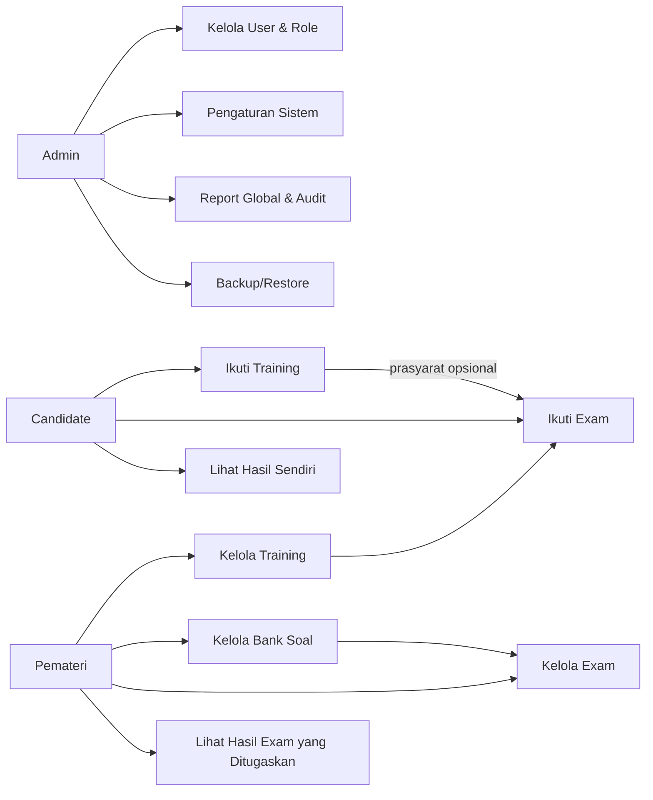
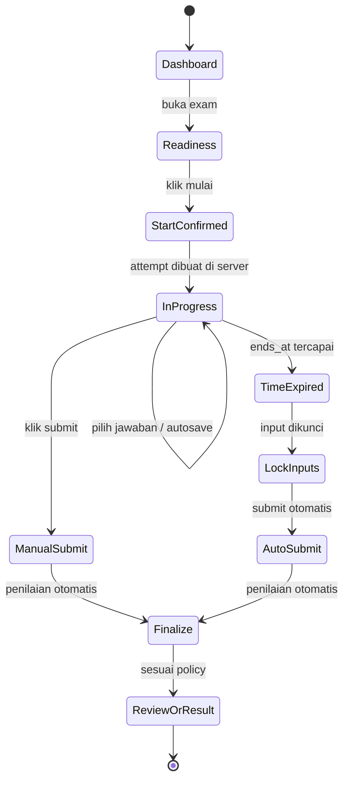

# Riset Mendalam Aplikasi Ujian Online Berbasis Web untuk Kandidat Karyawan

## Ringkasan eksekutif

Untuk kebutuhan aplikasi ujian online berbasis web bagi calon karyawan dengan **modul training**, **modul exam bertimer otomatis**, **auto-submit saat waktu habis**, **soal pilihan ganda acak**, **tiga role** (candidate, pemateri, admin), dan **SQLite**, pendekatan yang paling rasional adalah **arsitektur monolitik dengan satu application server** dan database SQLite yang berjalan **lokal pada host yang sama**, bukan arsitektur multi-instance serverless. Alasannya sederhana: SQLite memang sangat cocok untuk penyimpanan lokal aplikasi, prototipe cepat, dan banyak situs bertrafik rendah–menengah, tetapi tetap memiliki batas struktural penting seperti **satu penulis pada satu waktu** dan kurang cocok bila file database diakses langsung oleh banyak client melalui network filesystem. Mode **WAL** meningkatkan konkurensi baca/tulis, tetapi tidak mengubah kenyataan bahwa SQLite tetap bukan pengganti database client/server untuk pola multi-writer berat atau multi-server yang menulis ke file lokal masing-masing. citeturn8search0turn0search0turn0search4turn18search8

Dari sisi produk, pola yang paling layak ditiru bukan satu platform tunggal, melainkan kombinasi praktik terbaik dari beberapa kelas produk. **Moodle** sangat kuat untuk **question bank**, **random question**, **pengaturan waktu**, dan **review/report**; **Canvas** baik untuk **item bank**, **moderation**, dan kontrol hasil; **Open edX** memberi contoh yang sangat jelas untuk **timed exam** yang tidak bisa dipause dan otomatis membatasi akses ketika waktu habis; **Google Classroom** kuat pada pola **distribusi materi/training**; sedangkan **ClassMarker** dan **TestInvite** memberi referensi yang bagus untuk UX assessment, randomisasi, time limit, dan kontrol delivery yang lebih ketat. Dengan kata lain, aplikasi Anda sebaiknya diposisikan sebagai **LMS ringan + assessment engine khusus rekrutmen**. citeturn12search17turn12search5turn12search2turn17search4turn17search7turn11search2turn11search5turn3search1turn3search2turn4search2turn4search4turn2search6turn2search18

Untuk implementasi, opsi paling efisien adalah **Laravel + Blade/Livewire + Tailwind + SQLite**, karena Laravel menyediakan dukungan SQLite resmi, starter kit autentikasi, session, hashing, dan authorization berbasis gates/policies; Livewire cocok untuk antarmuka dinamis tanpa harus membangun SPA penuh; dan Tailwind mempercepat UI dashboard yang rapi. Alternatif yang juga matang adalah **Django + template/admin** bila tim lebih kuat di Python, atau **Next.js + Prisma + SQLite** bila prioritas utamanya adalah frontend React, walaupun opsi itu memerlukan perhatian lebih pada deployment karena banyak platform serverless memiliki filesystem yang tidak persisten. citeturn5search0turn5search4turn0search2turn23search0turn23search1turn23search2turn21search0turn21search20turn5search2turn22search0turn22search7turn5search7turn5search1turn7search8turn7search21

Detail yang **belum ditentukan** dari permintaan Anda dan sebaiknya disimpan sebagai konfigurasi sistem adalah: **jumlah soal per ujian**, **passing grade**, **apakah hasil langsung ditampilkan atau ditunda**, **apakah review jawaban diperbolehkan**, **kebijakan retake**, **proctoring/lockdown browser**, **integrasi email/SMS/WhatsApp**, **SSO**, **branding**, **kebijakan retensi data kandidat**, dan **mekanisme import soal**. Agar sistem tetap fleksibel, semua parameter itu sebaiknya berada pada level konfigurasi admin, bukan di-hardcode.

## Aplikasi acuan dan pelajaran desain

Berikut adalah platform resmi yang paling relevan untuk dijadikan acuan desain, bukan untuk disalin persis, melainkan untuk memungut pola interaksi yang sudah teruji.

| Platform | Posisi acuan | Fitur yang relevan untuk ditiru | Catatan desain untuk aplikasi Anda | Sumber resmi |
|---|---|---|---|---|
| Moodle LMS | LMS + quiz engine | Question bank, random question, quiz timing, review/report, roles & permissions | Sangat relevan untuk modul training + exam terintegrasi | Moodle LMS, Quiz activity, Quiz settings, Question banks, Roles & permissions citeturn1search6turn12search17turn12search2turn25search16turn12search0 |
| Canvas LMS | LMS + assessment | Time limit, item banks, moderation, hasil dan report | Cocok sebagai referensi pengaturan ujian per kandidat dan tampilan hasil | Canvas official site, New Quizzes settings, item banks, moderation, results citeturn1search1turn17search4turn17search0turn17search7turn25search9 |
| Open edX | Course platform + timed exam | Timed exam, no pause/restart, alert saat waktu menipis, randomization | Referensi terbaik untuk lifecycle timed attempt yang ketat | Open edX timed exams and randomization docs citeturn11search2turn11search5turn11search0turn11search1 |
| Google Classroom | Training/material delivery | Kelas, tugas, kuis berbasis Forms, pertanyaan pilihan ganda | Paling cocok sebagai inspirasi untuk training module dan distribusi materi | Google Classroom product/help pages bahasa Indonesia citeturn3search1turn3search2turn3search5 |
| ClassMarker | Assessment-first | Question bank, random question, time limits, secure/private access, result stats | Bagus untuk benchmark UX admin dan anti-cheating ringan | ClassMarker official features/pages citeturn4search2turn4search4turn4search6turn4search9 |
| TestInvite | Secure exam software | Random selection, time limits, anti-cheating safeguards, secure delivery | Bagus sebagai referensi jika nanti fitur keamanan diperketat | TestInvite official pages citeturn2search6turn2search8turn2search18turn2search4 |

Pelajaran utamanya adalah sebagai berikut. **Moodle** menunjukkan bahwa **question bank + kategori soal + review options + report** adalah fondasi yang sangat kuat untuk membangun mesin ujian. **Canvas** menunjukkan pentingnya **moderation** dan **visibility control** atas hasil. **Open edX** menegaskan bahwa ujian bertimer harus diperlakukan sebagai **attempt yang punya awal dan akhir absolut**, bukan timer yang hanya hidup di browser. **Google Classroom** memperlihatkan bahwa training module akan lebih mudah dipakai bila struktur materinya sederhana: daftar materi, status selesai, dan transisi yang jelas ke ujian. **ClassMarker** dan **TestInvite** mengingatkan bahwa bahkan untuk sistem yang sederhana, **randomisasi, time limit, dan access control** adalah fitur inti, bukan tambahan. citeturn12search5turn25search10turn17search7turn25search17turn11search2turn11search5turn3search1turn3search2turn4search2turn2search6

Secara praktis, untuk kasus rekrutmen karyawan, saya tidak menyarankan menyalin kompleksitas penuh LMS umum. Yang lebih tepat adalah mengambil tiga lapisan desain: **lapisan training** seperti Classroom/Moodle, **lapisan exam** seperti Moodle/Open edX/Canvas, dan **lapisan administrasi hasil** seperti Canvas/ClassMarker. Dengan begitu, aplikasi tetap fokus, cepat dibangun, dan tidak tenggelam menjadi LMS generik yang terlalu besar untuk kebutuhan rekrutmen. citeturn3search1turn12search17turn11search2turn17search7turn4search2

## Fitur yang direkomendasikan

### Fitur global

Aplikasi sebaiknya memiliki fitur global berikut sebagai baseline produk.

| Area | Fitur inti | Status rekomendasi |
|---|---|---|
| Identitas pengguna | Login, logout, reset password, session management, role-based access | Wajib |
| Dashboard | Dashboard berbeda per role | Wajib |
| Training | Modul, lesson, progress, completion gate ke exam | Wajib |
| Exam | Soal pilihan ganda, randomisasi, timer, auto-submit, auto-lock saat selesai | Wajib |
| Hasil | Skor otomatis, status lulus/gagal, riwayat attempt | Wajib |
| Pelaporan | Filter hasil per exam, kandidat, tanggal, pemateri | Wajib |
| Audit | Audit log perubahan penting dan aktivitas attempt | Wajib |
| Export | Export hasil ke CSV/XLSX, dengan sanitasi formula | Wajib |
| Pengaturan | Setting passing grade, durasi, review policy, release hasil | Wajib |
| File materi | Upload PDF/video/link/file lesson | Wajib |
| Notifikasi | Email invite / pengingat / submission receipt | Opsional |
| Integrasi | SSO, HRIS, API eksternal | tidak ditentukan |
| Proctoring | Fullscreen lockdown, webcam, screen monitoring | tidak ditentukan |

Secara konseptual, daftar di atas selaras dengan pola fitur yang tersedia pada Moodle, Canvas, Open edX, Google Classroom, ClassMarker, dan TestInvite: materi/training, bank soal, timed quiz, moderation/results, reports, dan access control. Untuk ekspor, sanitasi spreadsheet perlu dianggap fitur produk, bukan detail teknis belaka, karena CSV/Excel dapat menjadi vektor **CSV Injection** bila data tak tepercaya diekspor mentah. citeturn12search17turn12search21turn17search4turn17search7turn25search17turn11search2turn11search5turn3search2turn4search2turn2search6turn9search0turn9search4

### Fitur per role

| Role | Fitur yang disarankan | Batasan |
|---|---|---|
| Candidate | Melihat training yang ditugaskan, membuka lesson, menandai selesai, melihat exam yang assigned, start exam, menjawab soal, submit manual, auto-submit jika waktu habis, melihat hasil sendiri sesuai policy | Tidak boleh melihat bank soal, data kandidat lain, konfigurasi sistem |
| Pemateri | Membuat/mengubah training module, lesson, bank soal, soal & opsi jawaban, menyusun exam, menentukan durasi, jendela ujian, passing grade, melihat progress & hasil untuk exam yang dimiliki/ditugaskan, export hasil terbatas | Tidak boleh mengelola admin, konfigurasi sistem global, backup database, audit log seluruh sistem |
| Admin | Semua hak pemateri, plus kelola user & role, assignment kandidat, pengaturan sistem, policy hasil/review, backup/restore, audit log, export global, aktivasi/nonaktif akun, retention policy | Full access |

Model role seperti ini sangat konsisten dengan praktik **roles and permissions** di Moodle, authorization berbasis **gates/policies** di Laravel, dan permissions/groups di Django. Dengan kata lain, role sebaiknya tidak hanya dipakai untuk mengubah menu, tetapi untuk menegakkan izin pada setiap endpoint dan aksi model. citeturn12search0turn12search8turn0search2turn22search1turn22search7

### Diagram hubungan role dan domain



Diagram ini merepresentasikan model operasional yang paling aman untuk kebutuhan Anda: pemateri memegang konten dan evaluasi, admin memegang kontrol sistem, dan kandidat hanya berinteraksi dengan training, exam, dan hasil milik sendiri. Pola ini sejalan dengan konsep pemisahan capability pada Moodle dan authorization model di Laravel/Django. citeturn12search0turn0search2turn22search1

## Alur UI dan UX yang disarankan

### Alur login dan dashboard

Halaman login sebaiknya sederhana: email/username, password, opsi lupa kata sandi, dan indikator role setelah sukses login. Setelah masuk, setiap role diarahkan ke dashboard yang berbeda. **Candidate** melihat daftar training aktif, exam yang akan datang, exam yang sudah selesai, dan status training completion. **Pemateri** melihat modul milik sendiri, bank soal, exam aktif, dan hasil ringkas. **Admin** melihat ringkasan sistem, user, audit, dan export/report tingkat atas. Karena framework seperti Laravel dan Django memang sudah menyediakan fondasi auth, permissions, session, dan starter/admin kit, membangun dashboard berbasis role jauh lebih efisien bila menjaga aplikasi tetap monolitik. citeturn23search0turn23search6turn23search2turn22search7turn22search0

### Alur training module

Training module yang paling mudah dipakai biasanya berbentuk **daftar modul → daftar lesson → detail lesson → progress**. Setiap lesson dapat berupa teks, video embed, PDF, atau link eksternal. Untuk candidate, lesson yang sudah dibuka dapat ditandai selesai secara manual atau otomatis berdasarkan aturan sederhana. Untuk rekrutmen, saya menyarankan **completion gate**: exam hanya dapat dimulai bila semua lesson wajib berstatus selesai, atau bila admin/pemateri mematikan prasyarat tersebut. Pendekatan ini meniru prinsip distribusi materi Google Classroom dan struktur kegiatan/resources Moodle, tetapi dibuat lebih ringkas. citeturn3search1turn3search2turn12search3turn12search11

### Alur memulai exam

Sebelum exam dimulai, candidate harus melewati halaman **readiness** yang menampilkan: judul exam, durasi, jumlah soal yang akan ditarik secara acak, apakah review diizinkan, apakah hasil langsung terlihat, aturan bahwa exam tidak dapat dipause, dan konfirmasi final “Saya siap memulai”. Pola “ready to start” ini sangat sesuai dengan Open edX, yang secara eksplisit meminta learner memulai timed exam dengan sadar dan menegaskan bahwa exam tidak bisa dipause atau diulang setelah dimulai. Canvas dan Moodle juga memperlakukan timer sebagai setting attempt, bukan sekadar penghitung visual. citeturn11search5turn11search2turn17search1turn12search2

### Perilaku timer, auto-submit, dan auto-close

Logika terpenting dalam sistem Anda adalah **timer harus otoritatif di server**, bukan di browser. Saat candidate menekan mulai, backend membuat record `exam_attempt` dengan `started_at` dan `ends_at`. Frontend hanya menampilkan countdown berdasarkan `server_now` dan `ends_at`. Jika candidate menutup tab, refresh, atau membuka tab baru, server tetap tahu sisa waktu yang sah. Ketika `ends_at` terlewati, server harus menolak perubahan jawaban baru, menandai attempt sebagai selesai/expired, melakukan penilaian otomatis, lalu mengarahkan pengguna ke halaman konfirmasi submit atau hasil, tergantung policy yang diaktifkan. Cara berpikir ini sejalan dengan perilaku timed exam pada Moodle, Canvas, dan Open edX, yang semuanya menempatkan time limit pada level attempt. citeturn12search2turn12search18turn17search1turn17search4turn11search2turn11search5

Istilah “auto-close” pada web sebaiknya ditafsirkan sebagai **menutup sesi ujian**, bukan memaksa browser/tab benar-benar tertutup. Browser modern hanya mengizinkan `window.close()` pada jendela yang script-opened, sehingga memaksa tab normal untuk tertutup biasanya tidak andal. Dengan demikian, implementasi yang realistis adalah: saat waktu habis, **lock seluruh input**, tampilkan status “waktu habis”, kirim auto-submit, lalu **redirect** ke halaman “ujian selesai” atau “hasil”. Ini jauh lebih stabil dan sesuai batas browser modern. citeturn20search0turn20search1

Untuk mengurangi kehilangan data, jangan menggantungkan keselamatan jawaban pada `beforeunload`, karena event itu memang memiliki dukungan terbatas lintas browser. Yang lebih aman adalah **server-side save on change** atau **autosave periodik**, lalu gunakan `beforeunload` hanya sebagai peringatan tambahan. Jika ingin mengurangi penggunaan banyak tab, Anda bisa memakai **Page Visibility API** untuk memberi warning ketika tab disembunyikan dan **BroadcastChannel** untuk mendeteksi tab ganda pada origin yang sama. Namun sinyal-sinyal itu lebih tepat dipakai sebagai **telemetri dan peringatan**, bukan bukti tunggal kecurangan; bahkan Canvas sendiri menegaskan bahwa quiz logs tidak boleh dipakai sendirian untuk memvalidasi integritas akademik. citeturn20search14turn13search2turn13search1turn13search17turn13search3turn17search7

### Alur review dan hasil

Setelah submit manual atau auto-submit, sistem masuk ke **post-attempt policy**. Di sini ada tiga pola yang paling masuk akal. Pola pertama: candidate hanya melihat pesan “ujian berhasil dikirim” dan skor disembunyikan. Pola kedua: candidate melihat skor total dan status lulus/gagal, tetapi tidak melihat kunci jawaban. Pola ketiga: candidate dapat meninjau butir per butir, termasuk jawaban sendiri, skor, dan feedback. Platform seperti Moodle dan Canvas sama-sama menunjukkan bahwa visibilitas hasil sebaiknya **dapat dikonfigurasi**, bukan default tunggal. Untuk rekrutmen, pilihan yang paling aman biasanya adalah **skor total + status lulus/gagal** tanpa menampilkan kunci jawaban, kecuali exam bersifat latihan atau training assessment. citeturn25search9turn25search1turn25search7turn25search10turn25search20

### Diagram alur exam



Diagram ini menekankan bahwa event yang paling penting bukan “timer visual mencapai nol”, melainkan **server menganggap attempt telah kadaluarsa**. Itulah sebabnya `ends_at` dan status attempt harus menjadi pusat logika domain ujian. Pola ini selaras dengan model timed exam pada Open edX, Moodle, dan Canvas. citeturn11search2turn11search5turn12search2turn17search4

## Arsitektur teknis, API, dan stack yang direkomendasikan

### Arsitektur backend yang disarankan

Dengan constraint SQLite, arsitektur yang paling tepat adalah **modular monolith**. Secara logis ia dipisah menjadi modul `Auth/RBAC`, `Training`, `Question Bank`, `Exam Engine`, `Result & Reporting`, `Audit & Export`, dan `System Config`, tetapi tetap berjalan dalam satu aplikasi web. Pendekatan ini sangat sejalan dengan rekomendasi penggunaan SQLite sebagai **application-specific server-side database**: klien berbicara ke application server, lalu server menerjemahkan request menjadi SQL, bukan klien mengakses database secara langsung. Selain lebih aman, pola ini juga cocok dengan fakta bahwa SQLite bekerja baik untuk aplikasi tersentralisasi pada satu host dengan concurrency penulisan yang terukur. citeturn8search0turn0search0

Secara infrastruktur, aplikasi sebaiknya dipasang seperti ini: **reverse proxy** (Nginx atau Caddy), **application process** (misalnya PHP-FPM/Laravel atau Gunicorn/Uvicorn untuk Django), dan **SQLite database file** pada volume persisten lokal. Aktifkan **WAL mode** dan pastikan **foreign key enforcement** dinyalakan pada setiap koneksi, karena enforcement foreign key di SQLite bukan default global file database. Anda juga perlu menyiapkan kebijakan backup berbasis SQLite Backup API atau snapshot volume. citeturn0search0turn14search0turn14search1turn14search11turn15search0

Contoh inisialisasi koneksi awal yang masuk akal adalah sebagai berikut.

```sql
PRAGMA foreign_keys = ON;
PRAGMA journal_mode = WAL;
PRAGMA busy_timeout = 5000;
```

Makna teknisnya penting: `foreign_keys` memastikan integritas relasi dijalankan, `WAL` memperbaiki pola concurrency baca/tulis, dan `busy_timeout` memberi waktu tunggu ketika lock terjadi. Nilai timeout spesifiknya tetap pilihan implementasi, tetapi mekanismenya resmi tersedia di SQLite. citeturn14search1turn0search0turn18search2

### Opsi stack frontend dan backend

| Opsi stack | Kecocokan untuk proyek ini | Kelebihan | Kekurangan | Penilaian |
|---|---|---|---|---|
| **Laravel + Blade/Livewire + Tailwind + SQLite** | Sangat tinggi | SQLite resmi, starter kit auth, policies, session, hashing, UI reaktif tanpa SPA penuh | Ekosistem PHP; tim harus nyaman dengan Laravel | **Rekomendasi utama** citeturn5search0turn23search0turn23search1turn23search2turn0search2turn21search0turn21search20 |
| **Django + Templates/Admin + SQLite** | Tinggi | SQLite resmi, auth/groups/permissions built-in, admin interface kuat untuk backoffice | Frontend interaktivitas perlu tambahan pola JS/HTMX/custom | Rekomendasi alternatif kuat citeturn5search2turn5search6turn22search0turn22search7turn22search1 |
| **Next.js + React + Prisma + SQLite** | Sedang | Sangat fleksibel di frontend, auth guide resmi, Prisma nyaman untuk model type-safe | Deployment ke serverless perlu hati-hati karena filesystem yang tidak persisten | Cocok bila tim React dominan citeturn5search7turn5search15turn5search1turn7search8 |

Untuk kasus Anda, saya akan memilih **Laravel monolith** kecuali ada alasan organisasi yang sangat kuat untuk Python atau React. Alasan utamanya bukan preferensi bahasa, melainkan **fit terhadap constraint SQLite + RBAC + admin dashboard + exam workflow yang deterministik**. Laravel memberi jalur tercepat untuk auth, role/authorization, session, halaman CRUD backoffice, dan komponen UI dinamis yang cukup untuk timer, attempt screen, dan dashboard tanpa memaksa kompleksitas frontend berlebih. citeturn23search0turn23search6turn23search11turn0search2turn21search0

### Saran desain API

Struktur endpoint berikut cukup lengkap untuk versi produksi pertama.

| Method & path | Role | Fungsi |
|---|---|---|
| `POST /auth/login` | publik | Login |
| `POST /auth/logout` | semua | Logout |
| `GET /me` | semua | Profil role aktif |
| `GET /training/modules` | candidate/pemateri/admin | Daftar modul sesuai hak akses |
| `POST /training/modules` | pemateri/admin | Buat modul training |
| `PATCH /training/modules/{id}` | pemateri/admin | Ubah modul |
| `GET /training/modules/{id}/lessons` | sesuai hak | Ambil lesson |
| `POST /training/lessons` | pemateri/admin | Tambah lesson |
| `POST /training/lessons/{id}/complete` | candidate | Tandai selesai / progress update |
| `GET /question-banks` | pemateri/admin | Daftar bank soal |
| `POST /question-banks` | pemateri/admin | Buat bank soal |
| `POST /questions` | pemateri/admin | Tambah soal pilihan ganda |
| `PATCH /questions/{id}` | pemateri/admin | Ubah soal |
| `GET /exams` | semua sesuai hak | Daftar exam |
| `POST /exams` | pemateri/admin | Buat exam |
| `POST /exams/{id}/assign` | admin/pemateri terbatas | Assign exam ke kandidat |
| `GET /exams/{id}/readiness` | candidate | Aturan sebelum mulai |
| `POST /exams/{id}/start` | candidate | Membuat attempt |
| `GET /attempts/{id}` | sesuai hak | Ambil kondisi attempt, timer, soal |
| `POST /attempts/{id}/answers` | candidate | Simpan jawaban |
| `POST /attempts/{id}/heartbeat` | candidate | Sinkronisasi waktu/status aktif |
| `POST /attempts/{id}/submit` | candidate/system | Submit manual atau otomatis |
| `GET /attempts/{id}/review` | candidate/pemateri/admin | Review attempt sesuai policy |
| `GET /results/me` | candidate | Hasil sendiri |
| `GET /results/exams/{id}` | pemateri/admin | Rekap hasil exam |
| `GET /exports/results` | pemateri/admin | Export hasil terfilter |
| `GET /admin/users` | admin | Kelola akun |
| `GET /admin/audit-logs` | admin | Lihat audit trail |
| `POST /admin/settings` | admin | Pengaturan global |

Jika Anda memakai Laravel atau Django, endpoint mutasi sebaiknya tetap dilindungi **session + CSRF** untuk panel web internal. Bila suatu hari Anda menambah API eksternal atau mobile client, Anda bisa menambahkan token flow terpisah. OWASP juga menekankan bahwa REST endpoint harus berjalan di atas **HTTPS** dan authorization perlu diperiksa pada tiap request, bukan hanya pada tampilan UI. citeturn13search16turn13search0turn9search5

## Model data SQLite yang disarankan

Skema berikut dirancang agar sederhana, tetapi tetap cukup kuat untuk training, randomisasi soal, immutable attempt, auto-scoring, dan audit. Karena SQLite mendukung foreign key tetapi enforcement-nya perlu diaktifkan per koneksi, seluruh migration dan runtime app harus memastikan `PRAGMA foreign_keys = ON`. citeturn14search0turn14search1turn14search11

| Tabel | Kolom inti | Kunci / indeks utama | Keterangan |
|---|---|---|---|
| `users` | `id`, `full_name`, `email`, `password_hash`, `role`, `is_active`, `last_login_at`, `created_at`, `updated_at` | PK `id`, UNIQUE `email`, INDEX `(role,is_active)` | Semua pengguna. `role` dibatasi ke `candidate`, `instructor`, `admin`. |
| `sessions` | `id`, `user_id`, `ip_address`, `user_agent`, `last_activity_at`, `payload` | PK `id`, INDEX `user_id` | Opsional bila memakai database-backed sessions. |
| `training_modules` | `id`, `title`, `slug`, `summary`, `status`, `created_by`, `published_at`, `created_at`, `updated_at` | PK `id`, UNIQUE `slug`, FK `created_by -> users.id` | Modul training. |
| `training_lessons` | `id`, `module_id`, `title`, `content_type`, `content_body`, `file_path`, `external_url`, `sort_order`, `is_required`, `created_at`, `updated_at` | PK `id`, INDEX `(module_id,sort_order)`, FK `module_id -> training_modules.id` | Lesson per modul; isi bisa teks, PDF, video, atau link. |
| `training_progress` | `id`, `user_id`, `module_id`, `lesson_id`, `status`, `completed_at`, `last_viewed_at` | PK `id`, UNIQUE `(user_id,lesson_id)`, FK ke `users`, `training_modules`, `training_lessons` | Progress candidate per lesson. |
| `question_banks` | `id`, `name`, `description`, `owner_user_id`, `visibility`, `created_at`, `updated_at` | PK `id`, FK `owner_user_id -> users.id` | Bank soal milik pemateri/admin. |
| `questions` | `id`, `bank_id`, `category`, `difficulty`, `question_text`, `explanation_text`, `status`, `created_by`, `created_at`, `updated_at` | PK `id`, INDEX `(bank_id,category,difficulty,status)`, FK `bank_id -> question_banks.id` | Soal pilihan ganda. |
| `question_options` | `id`, `question_id`, `option_key`, `option_text`, `is_correct`, `sort_order` | PK `id`, UNIQUE `(question_id,option_key)`, FK `question_id -> questions.id` | Opsi jawaban A/B/C/D/E. |
| `exams` | `id`, `title`, `description`, `training_module_id`, `duration_minutes`, `question_count`, `shuffle_questions`, `shuffle_options`, `pass_score`, `available_from`, `available_until`, `allow_review_after_submit`, `result_release_mode`, `status`, `created_by`, `created_at`, `updated_at` | PK `id`, FK `training_module_id -> training_modules.id`, FK `created_by -> users.id` | Konfigurasi exam. `result_release_mode` misalnya `hidden`, `score_only`, `full_review`. |
| `exam_question_rules` | `id`, `exam_id`, `bank_id`, `category`, `difficulty`, `pick_count` | PK `id`, INDEX `exam_id`, FK `exam_id -> exams.id`, FK `bank_id -> question_banks.id` | Aturan penarikan soal acak dari bank/kategori. |
| `exam_assignments` | `id`, `exam_id`, `user_id`, `assigned_by`, `assigned_at`, `attempt_limit`, `extra_time_minutes`, `status` | PK `id`, UNIQUE `(exam_id,user_id)`, FK ke `exams`, `users` | Menentukan kandidat mana yang boleh ikut exam. |
| `exam_attempts` | `id`, `exam_id`, `user_id`, `assignment_id`, `status`, `started_at`, `ends_at`, `submitted_at`, `last_heartbeat_at`, `score`, `max_score`, `percentage`, `passed`, `auto_submitted`, `created_at`, `updated_at` | PK `id`, INDEX `(exam_id,user_id,status)`, FK ke `exams`, `users`, `exam_assignments` | Satu attempt. `status` misalnya `in_progress`, `submitted`, `expired`, `graded`. |
| `attempt_questions` | `id`, `attempt_id`, `question_id`, `display_order`, `question_text_snapshot`, `explanation_snapshot`, `option_a_snapshot`, `option_b_snapshot`, `option_c_snapshot`, `option_d_snapshot`, `option_e_snapshot`, `correct_option_snapshot`, `selected_option`, `is_correct`, `point_value`, `answered_at` | PK `id`, UNIQUE `(attempt_id,display_order)`, FK `attempt_id -> exam_attempts.id` | Snapshot immutable soal dan jawaban pada saat attempt dimulai. |
| `result_exports` | `id`, `requested_by`, `filters_json`, `file_path`, `created_at` | PK `id`, FK `requested_by -> users.id` | Catatan export hasil untuk audit. |
| `audit_logs` | `id`, `user_id`, `action`, `entity_type`, `entity_id`, `ip_address`, `user_agent`, `metadata_json`, `created_at` | PK `id`, INDEX `(entity_type,entity_id)`, INDEX `user_id` | Audit trail administratif dan keamanan. |

Desain tabel `attempt_questions` adalah keputusan yang sangat penting. Jangan hanya menyimpan relasi ke `questions` lalu menilai berdasarkan isi tabel soal terbaru, karena itu akan merusak konsistensi historis ketika pemateri mengubah soal setelah candidate selesai. Pola **snapshot per attempt** memastikan hasil lama tetap valid walaupun bank soal berevolusi. Ini adalah inferensi desain yang kuat dari cara platform quiz modern memisahkan bank soal dari lifecycle attempt dan review/report. citeturn12search17turn25search10turn17search4turn17search7

Di atas skema ini, saya menyarankan constraint bisnis berikut. Satu candidate hanya boleh memiliki **satu attempt aktif** untuk satu exam pada satu waktu. `exam_attempts.ends_at` harus dihitung sekali saat start, lalu tidak berubah kecuali ada akomodasi resmi (`extra_time_minutes`) dari admin/pemateri. `exam_question_rules` membolehkan randomisasi terstruktur, misalnya “ambil 20 soal: 10 easy, 5 medium, 5 hard” atau “ambil 15 soal dari kategori produk dan 10 soal dari kategori SOP”. Ini jauh lebih baik daripada sekadar mengacak urutan semua soal. citeturn12search1turn12search5turn17search0turn17search3

## Keamanan, deployment, QA, estimasi, dan prompt implementasi

### Pertimbangan keamanan yang wajib

Keamanan aplikasi ini menyentuh tiga area: **autentikasi/otorisasi**, **integritas exam**, dan **perlindungan data pribadi kandidat**. Untuk autentikasi, simpan password hanya dalam bentuk hash yang kuat melalui fasilitas framework, bukan encryption reversibel. Laravel dan Django sama-sama menyediakan fondasi auth yang matang, sementara OWASP menekankan penggunaan password hashing yang benar dan pengelolaan sesi yang kuat; session ID juga perlu entropy yang memadai. Untuk admin, **2FA** sangat layak dipertimbangkan, terutama bila ada fitur export data kandidat dan backup. citeturn23search1turn23search6turn22search7turn9search1turn0search5turn23search3

Untuk otorisasi, semua aksi penting harus diperiksa di server. Jangan pernah mengasumsikan bahwa menyembunyikan tombol di UI sudah cukup. OWASP Authorization Cheat Sheet, Laravel policies, dan Django permissions semuanya bergerak pada prinsip yang sama: authorization harus ditegakkan pada resource/action yang diminta, bukan sekadar dibedakan lewat role di frontend. Ini sangat penting untuk pemateri, karena role ini memang **dibatasi**, bukan admin mini. citeturn9search5turn0search2turn22search1

Untuk integritas exam, lindungi sistem dari manipulasi request dengan **parameterized queries / ORM**, validasi input, CSRF protection untuk panel web, dan HTTPS untuk seluruh endpoint. SQL Injection tetap salah satu risiko web paling umum, dan OWASP secara eksplisit merekomendasikan prepared statements sebagai kontrol utama. Karena exam merupakan proses stateful, gunakan session/cookie aman pada aplikasi web internal dan simpan state attempt di server, bukan di browser. citeturn0search1turn13search0turn9search15turn9search16

Jika training module mengizinkan upload file seperti PDF, gambar, atau video thumbnail, perlakukan file upload sebagai area berisiko. Validasi extension, MIME type, ukuran file, nama file, dan lokasi penyimpanan; simpan file di path yang tidak executable; dan jangan pernah mempercayai metadata file dari klien. OWASP File Upload Cheat Sheet sangat jelas dalam hal ini. citeturn9search3turn9search9turn9search23

Untuk export data, ancaman yang sering terlewat adalah **CSV Injection**. Jika nama kandidat, email, atau kolom bebas lain diekspor ke CSV/XLSX dan nilainya diawali `=`, `+`, `-`, atau `@`, spreadsheet bisa mengevaluasinya sebagai formula. Karena export hasil merupakan fitur yang hampir pasti dibutuhkan, sanitasi ini harus built-in. Selain itu, semua export perlu dicatat di `result_exports` dan `audit_logs`. citeturn9search0turn9search4turn16view1

Karena Anda akan mengelola data pribadi kandidat, ada relevansi langsung dengan **UU No. 27 Tahun 2022 tentang Pelindungan Data Pribadi**, yang mengatur jenis data pribadi, hak subjek data, kewajiban pengendali/prosesor, pemrosesan, dan perlindungan data. Artinya, secara produk Anda sebaiknya menyiapkan minimal: pembatasan akses data, retensi terukur, audit log, dan prosedur export/delete sesuai kewenangan. citeturn10search0turn10search1

### Opsi deployment yang realistis

Untuk deployment, pilihan terbaik jika Anda **berkomitmen pada SQLite file lokal** adalah **single VPS** atau **single instance container** dengan volume persisten. Ini paling lurus, paling murah untuk tahap awal, dan paling sesuai dengan model SQLite. Jika ingin PaaS, pilih yang mendukung **persistent disk**. Render, misalnya, menyediakan persistent disk, tetapi dokumentasinya juga jelas menyebut filesystem layanan itu pada dasarnya ephemeral dan bahwa penggunaan SQLite membuat scaling ke banyak instance tidak aman karena tiap instance punya database lokal sendiri, yang menyebabkan fragmentasi data. citeturn7search1turn7search9turn7search21

**Vercel serverless** bukan pilihan baik untuk SQLite file lokal, karena function filesystem-nya read-only dengan scratch space `/tmp` yang tidak dirancang sebagai database persisten aplikasi. Jika Anda ingin memaksa gaya serverless, Anda butuh produk database lain, yang berarti menjauh dari constraint SQLite file lokal. citeturn7search8turn7search12

Dua opsi yang masih “berbau SQLite”, tetapi berbeda semantik operasional, adalah **Fly.io + LiteFS** dan **Cloudflare D1**. LiteFS mereplikasi database SQLite lokal ke node lain sehingga cocok bila nanti Anda menginginkan HA/edge, sedangkan D1 adalah database serverless terkelola dengan **semantik SQL SQLite**, bukan file SQLite lokal biasa. Bila requirement Anda betul-betul “pakai SQLite” dalam arti engine/semantik, D1 masih relevan. Bila requirement Anda “pakai file `.sqlite` lokal yang langsung dibawa bersama app”, maka single host atau Fly single machine lebih tepat. citeturn7search2turn7search18turn7search3turn7search7turn5search1

### Checklist testing dan QA

Strategi QA yang baik harus menggabungkan **unit test**, **integration test**, **HTTP/API test**, dan **end-to-end browser test**. Open edX secara eksplisit menekankan pentingnya kombinasi unit dan integration tests, dengan investasi berat pada unit test untuk robustnes jangka panjang. Untuk frontend browser flow, Playwright sangat cocok karena mendukung multi-browser dan trace/debugging yang baik. citeturn1search9turn19search0turn19search18

Checklist QA minimal yang saya sarankan adalah sebagai berikut.

| Area uji | Skenario utama |
|---|---|
| Auth | login berhasil/gagal, lupa password, session timeout, logout, force logout user nonaktif |
| RBAC | candidate tidak bisa akses admin route, pemateri tidak bisa ubah global config, admin bisa akses semua |
| Training | progress tersimpan, lesson wajib memblok start exam, file/link materi terbuka benar |
| Exam start | candidate hanya bisa mulai exam yang assigned dan dalam window waktu |
| Randomisasi | dua candidate menerima kombinasi/urutan soal berbeda sesuai aturan |
| Timer | countdown sinkron dengan `ends_at`, reload tidak mereset timer, tab kedua tidak membuat attempt baru |
| Auto-save | jawaban tersimpan saat pindah soal / pilih opsi / refresh |
| Auto-submit | saat waktu habis, input terkunci, submit otomatis, status attempt benar |
| Manual submit | submit sebelum waktu habis, skor benar, attempt tidak bisa diubah lagi |
| Review/result | sesuai policy: hidden / score only / full review |
| Reporting | hasil per exam dan per candidate akurat, filter sesuai tanggal dan pemateri |
| Export | CSV/XLSX sesuai filter, formula injection disanitasi, export tercatat di audit |
| SQLite | WAL aktif, foreign_keys aktif, lock contention tertangani, backup dapat dipulihkan |
| Security | SQL injection, CSRF, XSS, file upload abuse, authorization bypass, insecure direct object reference |
| Accessibility | keyboard navigation, label form jelas, kontras, status timer terbaca, focus management |
| Cross-browser | Chromium, Firefox, WebKit atau minimal browser yang ditetapkan organisasi |

Untuk accessibility, timed interaction perlu dipikirkan dengan hati-hati. WCAG 2.2 menekankan bahwa web harus memberi waktu yang memadai, atau setidaknya memberi peringatan dan mekanisme akomodasi jika time limit memang esensial. Dalam konteks ujian rekrutmen, time limit bisa dianggap esensial, tetapi Anda tetap sebaiknya mendukung **akomodasi individual** seperti penambahan waktu di assignment level untuk kandidat tertentu. Canvas dan Open edX juga sama-sama memiliki model akomodasi waktu tambahan untuk peserta individual. citeturn24search0turn24search1turn24search7turn17search13turn17search2turn11search2turn11search20

### Estimasi tugas pengembangan

Estimasi berikut adalah **estimasi analitis**, bukan angka baku vendor. Asumsinya: satu codebase monolitik, fitur sesuai permintaan Anda, tanpa proctoring berat, tanpa integrasi HRIS, dan tanpa mobile app native.

| Paket kerja | Isi pekerjaan | Estimasi usaha |
|---|---|---|
| Fondasi proyek | setup repo, autentikasi, role, layout dashboard, migration awal | Sedang |
| Training module | CRUD modul/lesson, progress candidate, gate ke exam | Sedang |
| Question bank | CRUD bank soal, soal pilihan ganda, kategori, import dasar bila diinginkan | Sedang |
| Exam engine | exam config, assignment, randomisasi, start attempt, timer, autosave, auto-submit | Tinggi |
| Result & review | scoring, result policy, review screen, rekap hasil | Sedang |
| Reporting & export | filter, tabel hasil, export CSV/XLSX, audit export | Sedang |
| Security hardening | CSRF, session hardening, authorization audit, upload validation, backup policy | Sedang |
| Testing & QA | unit, integration, end-to-end, bug fixing, UAT | Tinggi |
| Deployment | Docker/VPS/PaaS setup, SSL, backup restore test, observability dasar | Sedang |

Jika dikerjakan oleh satu developer berpengalaman penuh waktu, versi yang layak dipakai internal biasanya berada pada kisaran **MVP menengah**, bukan proyek mini. Jika dikerjakan tim kecil yang terdiri dari 1 backend/full-stack, 1 frontend/UI, dan 1 QA/paruh waktu, delivery akan jauh lebih aman. Estimasi kalender yang lebih presisi tetap **tidak ditentukan** karena sangat dipengaruhi keputusan stack, kualitas desain final, kebutuhan import soal, dan standar keamanan organisasi.

### Saran nama aplikasi

Berikut beberapa nama yang cukup cocok untuk konteks Indonesia dan tetap profesional.

| Nama | Nuansa |
|---|---|
| **Selektra** | ringkas, modern, dekat dengan kata seleksi |
| **UjiKarya** | formal, cocok untuk rekrutmen/training |
| **SiapUji** | mudah diingat, cocok untuk training ke exam |
| **TalentaTest** | menekankan evaluasi kandidat |
| **LulusPro** | lebih tegas ke hasil dan evaluasi |
| **NusaExam** | netral, terdengar lokal dan korporat |
| **CalonStep** | menekankan tahapan kandidat |
| **RekrutIQ** | lebih tech-oriented |
| **SkillGate** | bagus bila training menjadi prasyarat exam |
| **Aptika** | singkat, brandable, netral |

Pilihan nama final tetap **tidak ditentukan** karena tergantung citra merek perusahaan, domain yang tersedia, dan apakah sistem ini akan dipakai internal saja atau menjadi produk komersial.

### Prompt siap pakai dalam Bahasa Indonesia

Berikut prompt final yang bisa langsung Anda berikan ke AI lain untuk membangun aplikasinya.

```text
Buat aplikasi web full-stack untuk ujian online calon karyawan dengan arsitektur modular monolith dan database SQLite. Gunakan stack utama Laravel terbaru + Blade/Livewire + Tailwind CSS + SQLite, kecuali ada alasan teknis yang sangat kuat untuk memilih stack lain. Jangan gunakan PostgreSQL/MySQL. Fokus pada reliabilitas, keamanan, dan kemudahan deploy.

Tujuan aplikasi:
- Modul training/pembelajaran untuk calon karyawan.
- Modul exam/ujian online dengan timer otomatis.
- Saat waktu habis, ujian harus auto-submit.
- Setelah waktu habis, input jawaban harus terkunci dan sesi ujian ditutup/dianggap selesai.
- Soal pilihan ganda harus dapat diacak dari bank soal.
- Tiga role:
  1) candidate / calon karyawan
  2) instructor / presenter / pemateri dengan permission terbatas
  3) admin dengan full access

Jika ada detail yang belum tersedia, tandai sebagai "tidak ditentukan" di konfigurasi atau seed data.

Kebutuhan fitur:
1. Auth & role
- Login, logout, forgot password.
- Password di-hash aman.
- Middleware + authorization policy per role.
- Session aman.
- Admin opsional 2FA jika mudah diimplementasikan.

2. Training module
- Admin/pemateri dapat membuat training module.
- Modul berisi lesson bertipe teks, PDF, video, atau link.
- Candidate dapat melihat daftar modul yang ditugaskan.
- Progress lesson tersimpan.
- Modul dapat dijadikan prasyarat mengikuti exam.

3. Question bank
- Pemateri/admin dapat membuat question bank.
- Soal bertipe multiple choice.
- Untuk tiap soal simpan stem, explanation, difficulty, category, dan opsi A/B/C/D/E.
- Dukung random selection berdasarkan bank/kategori/difficulty.
- Soal dan opsi bisa diacak saat attempt dimulai.

4. Exam module
- Admin/pemateri dapat membuat exam dengan:
  - judul
  - deskripsi
  - durasi menit
  - jumlah soal
  - passing grade
  - available_from
  - available_until
  - shuffle_questions
  - shuffle_options
  - allow_review_after_submit
  - result_release_mode: hidden / score_only / full_review
- Exam dapat di-assign ke candidate tertentu.
- Candidate hanya bisa mulai exam jika:
  - exam diassign
  - waktu tersedia
  - prasyarat training terpenuhi jika diaktifkan
- Saat kandidat menekan tombol mulai:
  - buat exam_attempt
  - hitung started_at dan ends_at di server
  - tarik soal acak berdasarkan rule exam
  - buat snapshot soal ke attempt_questions
- Timer harus server-authoritative:
  - frontend hanya menampilkan countdown
  - reload halaman tidak boleh mereset timer
  - refresh atau buka ulang harus melanjutkan attempt yang sama
- Saat waktu habis:
  - semua input jawaban terkunci
  - sistem auto-submit
  - status attempt berubah menjadi selesai / expired / graded
  - redirect ke halaman konfirmasi atau hasil sesuai result policy
- Implementasikan autosave jawaban.
- Candidate tidak boleh memiliki dua attempt aktif untuk exam yang sama.
- Jika browser/tab kedua dibuka, tampilkan warning dan tetap jaga satu attempt aktif.

5. Result & review
- Skoring otomatis untuk pilihan ganda.
- Simpan score, max_score, percentage, passed.
- Tiga mode hasil:
  - hidden
  - score_only
  - full_review
- Candidate hanya bisa melihat hasil miliknya sendiri.
- Pemateri melihat hasil untuk exam yang dia miliki/ditugaskan.
- Admin melihat semua.

6. Reporting & export
- Tabel hasil per exam.
- Filter kandidat, tanggal, status lulus/gagal.
- Export CSV/XLSX.
- Sanitasi nilai export agar aman dari CSV Injection.
- Catat semua export di audit log.

7. Audit & security
- Audit log untuk login, logout, create/update/delete penting, assign exam, export data.
- Gunakan CSRF protection.
- Gunakan validation server-side untuk semua form.
- Gunakan query parameterized / ORM.
- Batasi upload file training dengan validasi tipe, ukuran, dan path aman.
- HTTPS assumed untuk deployment production.
- Pastikan authorization dicek di backend, bukan hanya di UI.
- Terapkan PRAGMA foreign_keys = ON pada setiap koneksi SQLite.
- Gunakan WAL mode untuk SQLite.

8. Database SQLite
Buat migration lengkap minimal untuk tabel:
- users
- sessions (jika pakai database session)
- training_modules
- training_lessons
- training_progress
- question_banks
- questions
- question_options
- exams
- exam_question_rules
- exam_assignments
- exam_attempts
- attempt_questions
- result_exports
- audit_logs

9. UI/UX
Buat halaman:
- login
- dashboard candidate
- dashboard pemateri
- dashboard admin
- daftar training module
- detail lesson
- daftar exam assigned
- readiness page sebelum exam dimulai
- halaman exam dengan timer sticky
- halaman review/hasil
- backoffice CRUD training, bank soal, exam, assignment, results
UI harus bersih, profesional, mobile-friendly secukupnya, dan fokus desktop terlebih dahulu bila perlu.

10. API / controller structure
Buat route dan controller/service layer yang rapi untuk:
- auth
- training
- question bank
- exam
- exam attempt
- results
- export
- admin settings
Pisahkan business logic penting ke service class, jangan semua di controller.

11. Testing
Tulis test minimal untuk:
- auth & role authorization
- prasyarat training
- start exam
- timer logic
- auto-submit saat time expired
- random question generation
- result calculation
- export authorization
- candidate tidak bisa akses data kandidat lain

12. Deployment
Siapkan build yang mudah dideploy ke VPS/container dengan SQLite file di persistent volume.
Sertakan:
- README instalasi
- env example
- command migration + seed
- instruksi backup database SQLite
- instruksi restore

Output yang saya inginkan dari Anda:
- struktur folder proyek
- migration
- model
- policy / authorization
- controller / service
- route
- view Blade/Livewire
- seeder contoh data
- test
- README
- penjelasan alur timer dan auto-submit
- contoh akun admin, pemateri, candidate

Prioritas:
1. fitur wajib bekerja end-to-end
2. timer dan auto-submit benar
3. role-based access aman
4. SQLite schema rapi
5. UI cukup bagus dan jelas
6. kode bersih dan bisa dikembangkan

Jika perlu membuat asumsi, tulis eksplisit sebagai "tidak ditentukan" lalu pilih default yang wajar dan mudah diubah lewat konfigurasi/admin.
```

Secara keseluruhan, jika target Anda adalah **aplikasi rekrutmen internal yang cepat jadi, aman, dan dapat dipelihara**, kombinasi paling kuat adalah: **modular monolith**, **SQLite lokal dengan WAL**, **role yang ketat**, **attempt berbasis `started_at/ends_at` di server**, **snapshot soal per attempt**, **hasil yang configurable**, dan **deployment single-host dengan persistent storage**. Ini adalah pilihan yang paling selaras dengan karakter SQLite, pola timed exam yang dipakai platform mapan, serta kebutuhan operasional sistem rekrutmen yang fokus dan tidak terlalu berat. citeturn8search0turn0search0turn12search2turn11search2turn17search4turn14search1turn15search0turn7search21